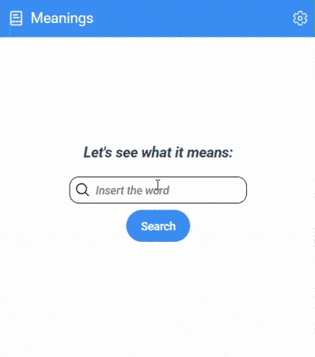

# Meanings

## An extension for chromium and firefox to search english words meanings in Cambridge dictionary

  

Meanings is a lightweight dictionary extension built with React and TypeScript. It allows you to search for English words and get detailed definitions, phonetic, and pronunciation audios using a clean and accessible UI. The extension integrates with a custom FastAPI backend to fetch dictionary data dynamically. See it here [Dictionary Api](https://github.com/skyx20/cambridge_api).

This program uses WXT next-gen framework for quick development of browser extensions. Ideal for language learners, students, and anyone who wants quick access to word meanings without leaving their current tab.

### API

The api endpoint is in `background.ts` file to fetch the word data

### How to install

- Clone the repo: `git clone https://github.com/skyx20/dictionary-extension.git`
- Open the folder in the terminal and install all dependencies: `npm i`
- If you have the target browser installed, WXT will find the path to it, just choose the one in the `web-ext.config.ts` folder. For more information see the [Built-in Enviroment Variables](https://wxt.dev/guide/essentials/config/environment-variables.html#built-in-environment-variables)
- if You want to set it mannually, create the enviroment variable in the .env and use it in `web-ext.config.ts`. For more information, see :[WXT Browser Startup ](https://wxt.dev/guide/essentials/config/browser-startup.html)
  _It's recommended to use a testing driver for better performance_

### How to run

- `npm run dev`

### How to build:

Add it to your browser, follow the steps:

- `npm run build`
- Go to "manage extensions" in your browser
- Activate "developer mode"
- Click on "load Unpacked"
- Search the path to '.output/chrome-mv3' (if you're using chrome) in the main folder.
- That's it. 😊
